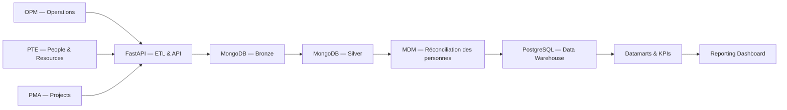

# Guide de soutenance — Plateforme unifiée OPM, PTE, PMA et Reporting

## 1. Problématique

Les activités opérationnelles, les ressources humaines et la gestion de projets sont réparties entre trois applications métier. Cette séparation crée des silos de données et rend difficile l'obtention d'une vision globale, fiable et actualisée pour la direction.

## 2. Solution proposée

La solution conserve les trois applications existantes et ajoute une couche décisionnelle unifiée :

- OPM gère les opérations, tickets, contrats et équipements.
- PTE gère les collaborateurs, congés, véhicules, salles et interventions.
- PMA gère les projets, tâches, réclamations et équipes.
- FastAPI orchestre l'ETL et expose une API sécurisée.
- MongoDB contient les sources, le bronze et le silver.
- PostgreSQL contient le modèle dimensionnel et les datamarts.
- Reporting présente les KPIs consolidés et les rapports.

## 3. Architecture

## 4. Pipeline ETL

1. **Extract** : collecte des données depuis les APIs métier.
2. **Bronze** : conservation des données brutes et traçables.
3. **Silver** : nettoyage, normalisation et déduplication.
4. **MDM** : rapprochement des utilisateurs entre OPM, PTE et PMA.
5. **Gold** : chargement des dimensions et des tables de faits.
6. **Datamarts** : calcul des KPIs destinés aux tableaux de bord.

Le backfill validé charge notamment 548 tickets OPM, 160 tâches PMA, 584 événements PTE et 752 références utilisateurs croisées.

## 5. Valeur métier

- Une vision à 360 degrés de l'entreprise.
- Réduction du temps nécessaire pour produire les rapports.
- Indicateurs calculés de manière cohérente et centralisée.
- Traçabilité grâce aux différentes couches ETL.
- Décisions facilitées par des tableaux de bord filtrables.
- Conservation des applications métier existantes sans migration risquée.

## 6. Sécurité et fiabilité

- Authentification JWT et contrôle des rôles.
- Routes analytiques protégées.
- Création des utilisateurs réservée à l'administrateur.
- CORS limité aux interfaces autorisées.
- Secrets placés hors du code source.
- En-têtes HTTP de sécurité.
- Sauvegarde MongoDB avant restauration.
- Health check de MongoDB et PostgreSQL.
- Suite automatique : 18 tests réussis, 0 échec.

## 7. Scénario de démonstration (7 à 10 minutes)

1. Exécuter `start-demo.bat` avant l'arrivée du jury.
2. Montrer le contrôle vert de tous les services.
3. Se connecter au Reporting Dashboard.
4. Présenter la vue exécutive globale.
5. Ouvrir successivement OPM, PTE et PMA.
6. Appliquer un filtre de période ou de statut.
7. Montrer un rapport sauvegardé ou un export.
8. Présenter brièvement `/docs` de FastAPI.
9. Terminer par l'architecture et la valeur métier.

Ne pas lancer une installation ou une restauration pendant la soutenance.

## 8. Questions probables du jury

### Pourquoi MongoDB et PostgreSQL ?

MongoDB convient aux données sources hétérogènes et aux couches bronze/silver. PostgreSQL fournit les jointures, contraintes et agrégations adaptées à un entrepôt décisionnel.

### Pourquoi ne pas remplacer les trois applications ?

La plateforme applique une intégration progressive : elle préserve les outils métier existants et centralise seulement la décision. Cela réduit le risque, le coût et l'impact organisationnel.

### Comment évitez-vous les doublons ?

Les données brutes utilisent des identifiants de source et d'exécution ETL. La couche silver conserve une version normalisée, puis le MDM rapproche les personnes grâce à l'email normalisé et aux références croisées.

### Que se passe-t-il si une source est indisponible ?

Les données précédemment ingérées restent disponibles. Les erreurs sont journalisées et le pipeline peut être relancé ou exécuter un backfill depuis la couche bronze.

### Comment passer en production ?

Déploiement conteneurisé, HTTPS, secrets gérés par l'environnement, sauvegardes planifiées, supervision, politique de rétention et base de démonstration anonymisée.

## 9. Phrase de conclusion

« Notre contribution n'est pas seulement la création de tableaux de bord : nous avons construit une chaîne décisionnelle complète qui transforme trois systèmes isolés en une source cohérente d'aide à la décision. »
